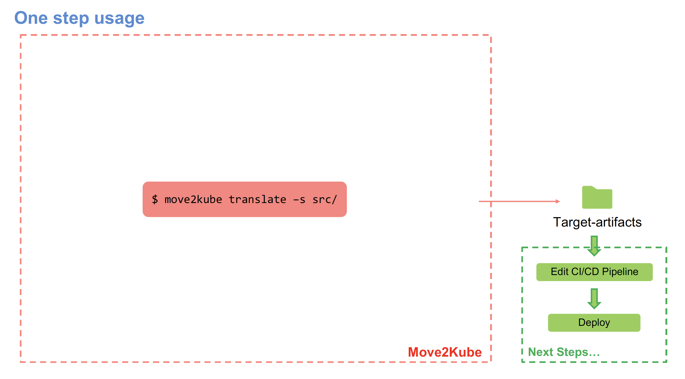

[](https://www.apache.org/licenses/LICENSE-2.0.html)
[](https://github.com/konveyor/homebrew-move2kube/pulls)
[](https://kubernetes.slack.com/archives/CR85S82A2)

# Move2Kube - Demos
### Accelerate your journey to Kubernetes/Openshift

## What is Move2Kube?
* Move2Kube is a command-line tool that accelerates the process of re-platforming to Kubernetes/Openshift.

* It is an open source project that can increase the efficiency of moving from various source platforms (like Swarm and Cloud Foundry) to Kubernetes/Openshift.

## Usage

Running Move2Kube is a simple single-step process. Move2Kube takes as input the source artifacts and outputs the target deployment artifacts.



For more detailed information :
* [Getting Started](./GettingStarted.md)
* [Tutorials](./Tutorials.md)

## Installation
Command line :
```
$ curl -L https://raw.githubusercontent.com/konveyor/move2kube/master/scripts/install.sh | bash -
```

UI :
```
$ git clone https://github.com/konveyor/move2kube-ui
```
```
$ docker-compose up
```
The UI will now be accessible in http://localhost:8080.


## Discussion

To discuss with the maintainers, reach out in [slack](https://kubernetes.slack.com/archives/CR85S82A2) in [kubernetes](https://slack.k8s.io/) workspace.

View the project on Github- [Move2Kube](https://github.com/konveyor/move2kube).
